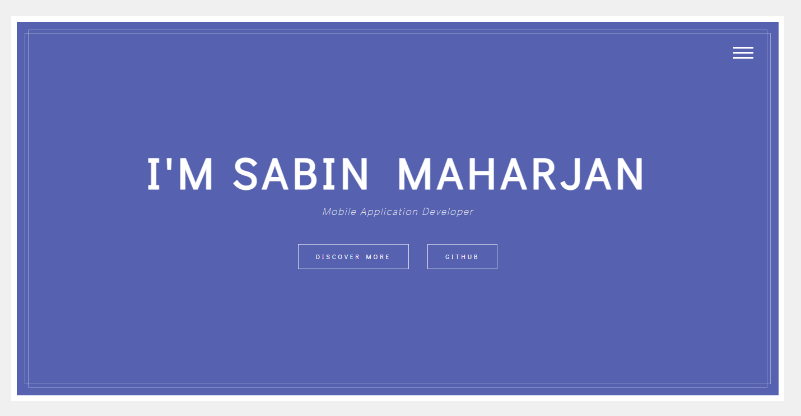

# Portfolio Website (Second Version)

<a herf="https://www.sabin-maharjan.com.np" target="_blank">Check My Website</a>



Welcome to my personal portfolio website! This is a showcase of my skills, projects, and achievements as a web developer. Feel free to explore and get to know me better.

## Table of Contents

- [Introduction](#introduction)
- [Technologies Used](#technologies-used)
- [Features](#features)
- [Setup Instructions](#setup-instructions)
- [Usage](#usage)
- [Contributing](#contributing)
- [Contact](#contact)
- [License](#license)

## Introduction

As a passionate web developer, I designed and developed this portfolio website to exhibit my proficiency in HTML, CSS, JavaScript, and PHP. It not only showcases my projects but also serves as a platform to share my experiences and skills with the community.

## Technologies Used

The following technologies were used to create this website:

- HTML
- CSS
- JavaScript
- PHP

## 🚀Features

- **About Me:** Learn more about my background, skills, and interests.
- **Portfolio:** Check out a selection of my latest projects with brief descriptions.
- **Contact:** Get in touch with me through the provided contact form.
- **Resume:** Download my resume to see my full work history and qualifications.

## Setup Instructions

To run this website locally on your machine, follow these steps:

1. Clone this repository to your local machine using
    ```
    git clone https://github.com/sabinmhx/portfolio-v2.git
    ```

2. Navigate to the project directory

    ```
    cd portfolio-v2
    ```
3. Set up a local PHP server (e.g., using XAMPP or MAMP).

4. Open the website in your web browser by visiting `http://localhost/portfolio-v2`


## Usage

Feel free to customize this website according to your preferences. Update the content in the HTML files, tweak the CSS styles, and add your own projects to the portfolio section.

## 🤝Contributing

If you find any issues with the website or have suggestions for improvement, please feel free to open an issue or create a pull request. Contributions are welcome!

## 📧Contact

Let's connect! You can reach me through the following channels:

- Website: [www.sabin-maharjan.com.np](https://www.sabin-maharjan.com.np)
- Email: sabinmhx@gmail.com
- LinkedIn: [@sabinmhx](https://www.linkedin.com/in/sabinmhx)
- Twitter: [@sabinmhx](https://twitter.com/sabinmhx)

## 📄License

This project is licensed under the [MIT License](LICENSE).

---

Thank you for visiting my portfolio website! I hope you enjoy exploring my work and learning more about me as a web developer. If you have any feedback or questions, don't hesitate to get in touch. Happy coding! 🚀
